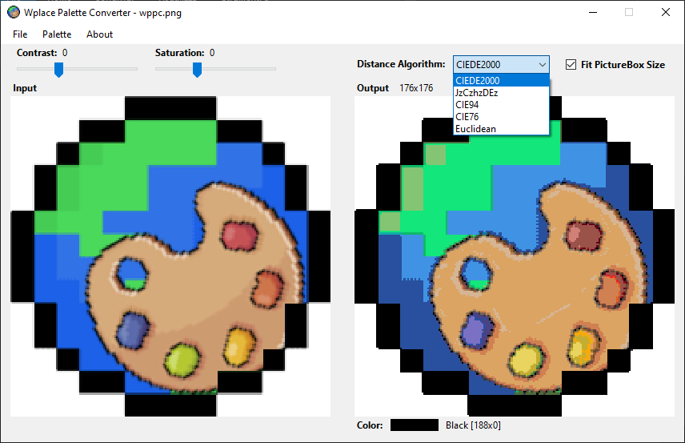

# Wplace Palette Converter

**Wplace Palette Converter** is a tool that converts the colors of an image into the official palette used by [wplace.live](https://wplace.live).  
It allows precise and customizable conversions by supporting multiple color difference algorithms.

## Features

- 🎨 **Color Palette Conversion**
  Converts any input image into the wplace.live palette.

- 📐 **Multiple Distance Algorithms**
  Choose from several algorithms to calculate color differences:
  - [CIEDE2000](https://en.wikipedia.org/wiki/Color_difference)
  - [JzCzhzDEz](https://observablehq.com/@jonhelfman/visualizing-jzczhz-color-space)
  - [CIE94](https://en.wikipedia.org/wiki/Color_difference)
  - [CIE76](https://en.wikipedia.org/wiki/Color_difference)
  - [Euclidean](https://en.wikipedia.org/wiki/Color_difference)

- 🧩 **Custom Palette Selection**
  Select which colors from the palette should be included in the conversion process.

- 🔍 **Zoom Support**
  Use the mouse wheel to zoom in and out for precise inspection of the converted image.

- 💾 **Export**
  Save the converted image in `.png` format.

## Screenshots

## Installation

This application need [.NET Desktop Runtime 8.0](https://dotnet.microsoft.com/it-it/download/dotnet/8.0/runtime).

Download the [latest release](https://github.com/Criper98/Wplace-Palette-Converter/releases/latest) and run!

### Build

Or clone the repository and publish the Visual Studio project.

## Usage

1. Load an image into the application.
2. Select the desired color difference algorithm.
3. Optionally, adjust which palette colors should be included.
4. Zoom in/out with the mouse wheel to inspect details.
5. Export the final image as a `.png`.

## Third-Party Libraries

This project makes use of the following libraries:

* [**Newtonsoft.Json**](https://www.newtonsoft.com/json)
* [**Colourful**](https://github.com/tompazourek/Colourful)